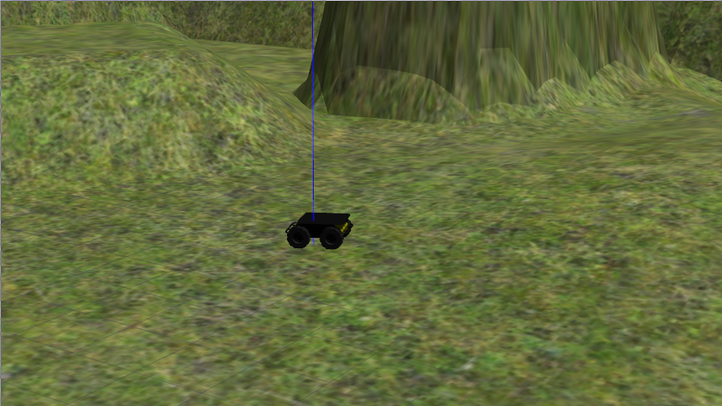

# Gazebo Terrain Tutorial

This package is part of a [YouTube tutorial](https://youtu.be/GNbH8Pf7nGk) to
demonstrate how custom terrain can be created in Blender and used in Gazebo
simulations. This ROS package provides the launch, world, and model files to
load the custom terrain into Gazebo and spawn a Clearpath Husky robot onto the
terrain.

## Installation

1. Clone this repository into the `src` in your ROS1 workspace

        $ cd /path/to/ros/workspace/src/
        $ git clone git@github.com:SyllogismRXS/gazebo_terrain_tutorial.git
        $ cd ../

2. Source the ROS system environment and source the Gazebo environment

        $ . /opt/ros/<ROS_DISTRO>/setup.bash
        $ . /usr/share/gazebo/setup.sh

3. Install dependencies and build the package

        $ rosdep install --from-paths src --ignore-src -r -y
        $ catkin_make

4. Source the workspace environment and launch the example

        $ . ./devel/setup.bash
        $ roslaunch gazebo_terrain_tutorial terrain_1.launch

At this point, Gazebo should have launched, loaded the custom terrain, and
spawned a Clearpath Husky robot onto the terrain. A common mistake is to forgot
to source the Gazebo environment in step 2.
